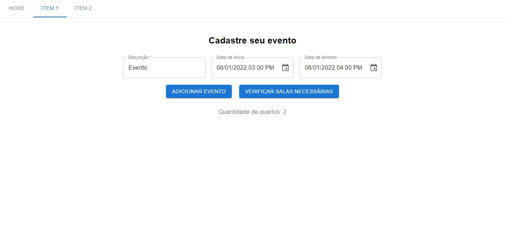
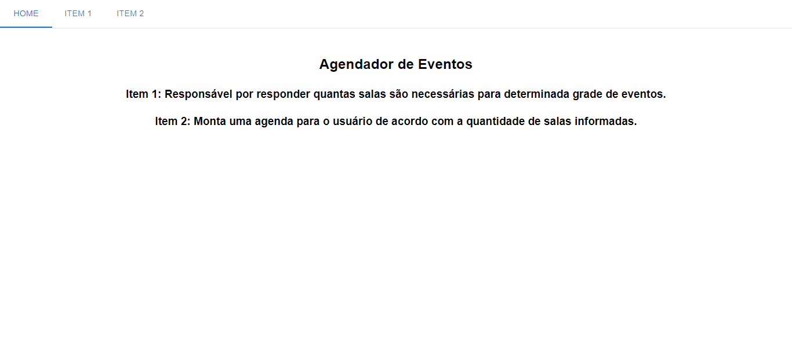

# Greed_Dupla22_GreedTimeGrid
**Número da Lista**: 22 
**Conteúdo da Disciplina**: Greed  
## Alunos
|Matrícula | Aluno |
| -- | -- |
| 190047968 | Paulo Vitor Silva Abi Acl |
| 160000572 | Adrian Soares Lopes |
## Sobre 
O sistema consiste em uma forma de agendar eventos para descobrir o número de salas necessário e para agendar o máximo de eventos de acordo com as datas.
 
## Screenshots
Print 1:

Print 2:

## Instalação 
**Linguagem**: Java Script 
**Framework**: ReactJs 
Versões:  
Node > v18  
Npm > 9
Comandos:  
Instalar com `npm install` na raiz do projeto  
Na pasta src, utilizar npm start
npm start  
## Uso 
Adicionar os eventos e apertar para calcular.